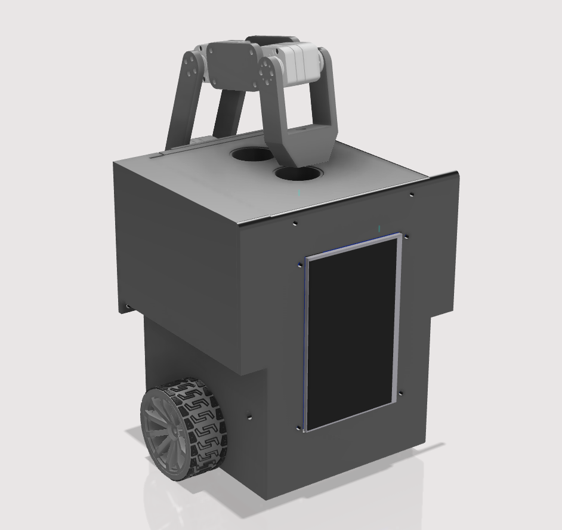

# coin_bot

## Overview
Coin-bot is a table top personal assitant that helps you save, withdraw coins. It tracks your saving behavior and creates real-time graph on both a touch screen on the robot as well as any device connected to the local network. Project submission to 2024 geek-haku hackathon.

  
  

## System 

